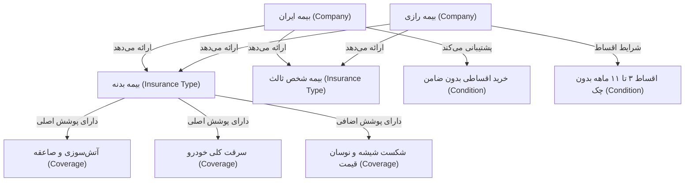

# راهنمای جامع معماری و راه‌اندازی Graphiti + Neo4j + Knowledge Graph

این مستند، راهنمای کامل راه‌اندازی، درک مفاهیم، ساختار داده‌ها و جریان کاری (Pipeline) گراف دانش **Graphiti** و دیتابیس **Neo4j** در سامانه مشاوره هوشمند بیمه است.

---

## فهرست مطالب
1. [Graphiti چیست؟](#۱-graphiti-چیست)
2. [Neo4j چیست؟](#۲-neo4j-چیست)
3. [چرا Graphiti و Neo4j با هم استفاده می‌شوند؟](#۳-چرا-graphiti-و-neo4j-با-هم-استفاده-میشوند)
4. [JSON چگونه وارد Graphiti می‌شود؟](#۴-json-چگونه-وارد-graphiti-میشود)
5. [Episode چیست و چرا از آن استفاده می‌کنیم؟](#۵-episode-چیست-و-چرا-از-آن-استفاده-میکنیم)
6. [LLM در مرحله Ingestion چه کاری انجام می‌دهد؟](#۶-llm-در-مرحله-ingestion-چه-کاری-انجام-میدهد)
7. [Knowledge Graph چگونه ایجاد می‌شود؟](#۷-knowledge-graph-چگونه-ایجاد-میشود)
8. [سؤال کاربر چگونه روی Graph جستجو می‌شود؟](#۸-سؤال-کاربر-چگونه-روی-graph-جستجو-میشود)
9. [Context چگونه ساخته می‌شود؟](#۹-context-چگونه-ساخته-میشود)
10. [Context چگونه به Gemini داده می‌شود؟](#۱۰-context-چگونه-به-gemini-داده-میشود)
11. [چگونه Ingestion را اجرا کنیم؟](#۱۱-چگونه-ingestion-را-اجرا-کنیم)
12. [چگونه دیتابیس Neo4j را اجرا و راه‌اندازی کنیم؟](#۱۲-چگونه-دیتابیس-neo4j-را-اجرا-و-راهاندازی-کنیم)
13. [متغیرهای محیطی (Environment Variables) موردنیاز](#۱۳-متغیرهای-محیطی-environment-variables-موردنیاز)
14. [نمونه سوالات تست و راستی‌آزمایی](#۱۴-نمونه-سوالات-تست-و-راستیآزمایی)

---

## ۱. Graphiti چیست؟

**Graphiti** یک فریم‌ورک متن‌باز و پیشرفته برای ساخت و مدیریت **Dynamic Knowledge Graphs** (گراف‌های دانش پویا و مبتنی بر زمان) است. 

برخلاف RAGهای سنتی مبتنی بر Vector Search ساده که متن‌ها را تکه‌تکه (Chunk) کرده و روابط بین مفاهیم را گم می‌کنند:
- Graphiti متن ورودی را می‌خواند.
- با کمک مدل زبانی (LLM)، **موجودیت‌ها (Entities)** و **روابط (Relationships)** میان آن‌ها را استخراج می‌کند.
- برای هر رابطه، یک **فکت (Fact)** مستقل و ساخت‌یافته همراه با بردار ویژگی (Embedding) تولید می‌نماید.
- گراف حاصل را درون یک دیتابیس گرافی استاندارد (مانند Neo4j) ذخیره و نگهداری می‌کند.

---

## ۲. Neo4j چیست؟

**Neo4j** محبوب‌ترین و قدرتمندترین پایگاه داده بومی گرافی (Native Graph Database) در دنیا است.

در Neo4j داده‌ها به جای جداول سطری و ستونی (رابطه‌ای)، به صورت زیر ذخیره می‌شوند:
- **گره‌ها (Nodes):** موجودیت‌ها (مانند `InsuranceCompany`, `InsuranceType`, `Coverage`).
- **یال‌ها (Edges / Relationships):** روابط معنادار میان گره‌ها (مانند `OFFERS`, `HAS_COVERAGE`, `REQUIRES`).
- **ویژگی‌ها (Properties):** اطلاعات تکمیلی مثل نام، تاریخ، امتیاز، فکت و بردارهای امبدینگ.

---

## ۳. چرا Graphiti و Neo4j با هم استفاده می‌شوند؟

Graphiti و Neo4j مکمل یکدیگر در معماری مدرن RAG هستند:
1. **Neo4j** لایه ذخیره‌سازی، ایندکس‌گذاری و کوئری‌گیری گرافی است.
2. **Graphiti** لایه هوش و ارکستراسیون است؛ یعنی متون زبان طبیعی را به ساختار گرافی تبدیل کرده و الگوریتم‌های بازیابی ترکیبی (ترکیب Vector Search و Graph Traversal) را پیاده می‌کند.

```
+-------------------------------------------------------------+
|                        Graphiti Engine                      |
|  - Entity & Relation Extraction (Gemini LLM)               |
|  - Semantic Fact Embedding (Gemini Embedder)               |
|  - Hybrid Graph & Vector Search                            |
+-------------------------------------------------------------+
                              ↕
+-------------------------------------------------------------+
|                        Neo4j Database                       |
|  - Stores Nodes (Entities) & Edges (Relationships)         |
|  - Manages Fulltext & Vector Indexes                       |
+-------------------------------------------------------------+
```

---

## ۴. JSON چگونه وارد Graphiti می‌شود؟

فایل‌های پایگاه دانش JSON در ریشه پروژه قرار دارند:
- `insurance_knowledge.json`: اطلاعات ۲ نوع بیمه (شخص ثالث و بدنه).
- `insurance_companies.json`: مشخصات ۲ شرکت بیمه (بیمه رازی و بیمه ایران).
- `consultation_knowledge.json`: سوالات متداول و ضوابط مشاوره.

دستور مدیریت جنگو (`python manage.py ingest_knowledge`) این فایل‌ها را می‌خواند، اطلاعات را بدون تغییر در منطق بیزینس قالب‌بندی متنی کرده و در قالب **Episode** به Graphiti ارسال می‌کند.

---

## ۵. Episode چیست و چرا از آن استفاده می‌کنیم؟

یک **Episode** در Graphiti، یک واحد زمانی-مفهومی از دانش ورودی است. 

هر Episode شامل مشخصات زیر است:
- **نام (Name):** عنوان اپیزود (مثلاً: `پایگاه دانش نوع بیمه: بیمه بدنه`)
- **متن بدنه (Episode Body):** تمام جزئیات، پوشش‌ها، قیمت‌گذاری و شرایط
- **توضیح منبع (Source Description):** نام فایل منبع (مانند `insurance_knowledge.json`)
- **زمان مرجع (Reference Time):** تاریخ ایجاد یا اعتبار دانش
- **شناسه گروه (Group ID):** پارتیشن‌بندی گراف (مثلاً `insurance_kb`)

استفاده از Episode باعث می‌شود منبع هر فکت مشخص باشد و در صورت تغییر قوانین، گراف بدون تداخل به‌روز شود.

---

## ۶. LLM در مرحله Ingestion چه کاری انجام می‌دهد؟

هنگامی که یک Episode به Graphiti تحویل داده می‌شود:
1. Graphiti متن Episode را به **Gemini 2.5 Flash** ارسال می‌کند.
2. جمینای متن را تحلیل کرده و به صورت خروجی ساخت‌یافته (Structured Output):
   - تمام موجودیت‌ها (Entities) را تشخیص می‌دهد (مثلاً `بیمه ایران`, `بیمه بدنه`, `سرقت کلی`, `خرید اقساطی`).
   - روابط معنادار (Edges) را پیدا می‌کند (مثلاً `بیمه ایران` -> `ارائه می‌دهد` -> `بیمه بدنه`).
   - یک گزاره طبیعی و خلاصه به عنوان `fact` می‌سازد.
3. سپس **Gemini Embedder** بردار امبدینگ معنایی فکت را تولید می‌کند.

---

## ۷. Knowledge Graph چگونه ایجاد می‌شود؟

اطلاعات خروجی LLM توسط Graphiti به کوئری‌های استاندارد Cypher تبدیل شده و در Neo4j ذخیره می‌شوند:



---

## ۸. سؤال کاربر چگونه روی Graph جستجو می‌شود؟

هنگامی که کاربر پیامی ارسال می‌کند (مثلاً: *«تفاوت بیمه رازی و ایران در پرداخت اقساطی چیست؟»*):
1. متد `GraphitiService.search_knowledge(user_message)` اجرا می‌شود.
2. سؤال کاربر توسط **Gemini Embedder** وکتورایز می‌شود.
3. موتور جستجوی Graphiti عملیات جستجوی برداری و پیمایش گرافی (Vector & Graph Search) را روی یال‌ها و فکت‌های ذخیره‌شده در Neo4j اجرا می‌کند.
4. مرتبط‌ترین یال‌ها و فکت‌های دانشی استخراج می‌شوند.

---

## ۹. Context چگونه ساخته می‌شود؟

فکت‌ها و روابط بازیابی‌شده از Graphiti پاکسازی شده، موارد تکراری حذف گردیده و به یک متن تمیز و ساختاریافته فارسی تبدیل می‌شوند:

```text
دانش و فکت‌های استخراج‌شده از پایگاه دانش گراف (Neo4j / Graphiti Knowledge Graph):
• شرکت بیمه رازی امکان خرید اقساطی ۳ تا ۱۱ ماهه بدون نیاز به چک یا ضامن را فراهم کرده است.
• شرکت بیمه ایران امکان خرید آنلاین اقساطی ۳ تا ۱۲ ماهه بدون ضامن را دارا می‌باشد.
• بیمه ایران تنها شرکت بیمه دولتی کشور با بالاترین امتیاز پرداخت خسارت است.
```

---

## ۱۰. Context چگونه به Gemini داده می‌شود؟

کانتکست تولیدشده به همراه تاریخچه پیام‌ها درون System Instruction مدل **Gemini 2.5 Flash** قرار می‌گیرد:

```
تو مشاور رسمی و هوشمند خرید بیمه هستی.

CONTEXT (پایگاه دانش گراف بازیابی‌شده از Graphiti):
{graphiti_knowledge_context}

قوانین رفتار هوشمند:
۱. پاسخ را با تکیه بر فکت‌های Context بالا ارائه بده.
۲. اصل عدم جعل اطلاعات (Anti-Hallucination): اگر اطلاعات درخواستی در Context وجود ندارد، اطلاعات جعلی تولید نکن و بگو: «اطلاعات کافی درباره این مورد در پایگاه دانش بیمه وجود ندارد.»
```

---

## ۱۱. چگونه Ingestion را اجرا کنیم؟

ابتدا مطمئن شوید دیتابیس Neo4j در حال اجراست و سپس دستور زیر را در ترمینال بک‌اند اجرا کنید:

```powershell
# ورود به پوشه backend و فعال‌سازی venv
cd backend
.\venv\Scripts\Activate.ps1

# اجرای Ingestion با اطلاعات موجود در JSONها
python manage.py ingest_knowledge
```

### گزینه‌های اضافی:
- پاکسازی گراف قبلی قبل از بارگذاری مجدد:
  ```powershell
  python manage.py ingest_knowledge --clear
  ```

---

## ۱۲. چگونه دیتابیس Neo4j را اجرا و راه‌اندازی کنیم؟

### روش اول: استفاده از Docker (پیشنهادی و سریع)
اگر Docker روی سیستم شما نصب است:

```bash
docker run -d \
  --name neo4j-insurance \
  -p 7474:7474 -p 7687:7687 \
  -e NEO4J_AUTH=neo4j/password \
  -e NEO4J_PLUGINS='["apoc"]' \
  neo4j:5.26-community
```

- داشبورد تحت وب Neo4j Browser: `http://localhost:7474`
- پورت اتصال پایتون (Bolt): `bolt://localhost:7687`
- نام کاربری: `neo4j`
- کلمه عبور: `password`

### روش دوم: نرم‌افزار Neo4j Desktop
1. نرم‌افزار **Neo4j Desktop** را از سایت رسمی دانلود و نصب کنید.
2. یک DBMS جدید نسخه ۵ بسازید.
3. پسورد آن را `password` (یا پسورد دلخواه خود) بگذارید.
4. روی دکمه **Start** کلیک کنید.

---

## ۱۳. متغیرهای محیطی (Environment Variables) موردنیاز

فایل `backend/.env` شامل متغیرهای زیر است:

```env
DEBUG=True
SECRET_KEY=django-insecure-smart-insurance-persian-platform-key-2026!#
GEMINI_API_KEY=your_gemini_api_key_here

# تنظیمات اتصال به Neo4j
NEO4J_URI=bolt://localhost:7687
NEO4J_USER=neo4j
NEO4J_PASSWORD=password
GRAPHITI_ENABLED=True
```

---

## ۱۴. نمونه سوالات تست و راستی‌آزمایی

پس از اجرای Ingestion، می‌توانید در محیط چت سوالات زیر را بپرسید:

| سناریوی تست | نمونه سوال کاربر | رفتار و پاسخ مورد انتظار |
| :--- | :--- | :--- |
| **تعریف و پوشش‌ها** | «بیمه بدنه چه پوشش‌هایی دارد؟» | بازیابی پوشش‌های اصلی (آتش‌سوزی، تصادف، سرقت کلی) و تکمیلی از گراف |
| **پوشش راننده مقصر** | «آیا بیمه شخص ثالث خسارت راننده مقصر را هم می‌دهد؟» | پاسخ مثبت برای خسارت جانی و هدایت به بیمه بدنه برای خسارت مالی خودرو |
| **مقایسه شرکت‌ها** | «تفاوت شرایط اقساطی بیمه رازی و بیمه ایران چیست؟» | مقایسه دوره‌های پرداخت اقساطی (۳-۱۱ ماه رازی در برابر ۳-۱۲ ماه ایران) بدون نیاز به چک |
| **تست عدم جعل (Anti-Hallucination)** | «شرایط بیمه سامان یا البرز چیست؟» | پاسخ دقیق: «اطلاعات کافی درباره این شرکت در پایگاه دانش بیمه وجود ندارد.» |
